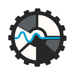

# Boldaric

*A Personal Radio Server Powered by Your Own Library and Machine Learning.*

---

Boldaric allows you to run machine learning on your personal music
collection to categorize and extract features across 148 dimensions.

Boldaric also provides a server for creating radio stations and
listening to similar songs based upon their features. You can think of
it as a self-hosted, personal Pandora music service: one with no ads,
no data sharing or tracking, and no algorithmic bias toward popular
tracks!

## Why Boldaric?

I have a large music collection that I've been building for 30
years. While I love my Navidrome server, I often find exploring my own
music collection to be difficult.

I found that recommendations based on popularity, neighborhoods
(last.fm data), genres, and so on missed the mark, especially if you
are interested in music that isn't popular or well known.

Unlike Pandora and Spotify, which push popular tracks or "algorithmic
filler," Boldaric focuses *only* on your library. If you value
control, privacy, and discovering overlooked gems in your collection,
this is for you.

For instance, you can create a station that plays only slow, ambient
tracks with female vocals—or crank up the aggression for high-energy
metal. ML-driven features let you dial in exactly what you want.

No data ever leaves your server. No ads, no tracking, no "trending
now" distractions—just your music, shaped by your preferences.

Traditional recommenders rely on metadata (genres, tags) or
popularity. Boldaric uses 148+ audio features (like timbre, rhythm,
and mood) to find *sonic* similarities—even across genres.

Boldaric was built to be a highly specific music recommendation
engine, powered solely by your music. The goal is to allow you to
highly tune your radio stations to explore your music how you want.

## Features

### Personal Radio

Boldaric includes a web server and web interface for creating personal
radio stations and listening to them, along with the ability to thumbs
up/thumbs down songs. This allows guiding the station to your
preferences.

This is completely based on features of the song and your individual
preferences, not song popularity or what other people listen to!

### Uses Your Music

Boldaric uses YOUR music library! You must have your music library
self-hosted with a [Subsonic](https://subsonic.org) compatible
server. I test with and recommend
[Navidrome](https://www.navidrome.org/), which is open source.

Recommendations will only come from your library, giving you much more
control over what it plays and what version of songs it plays.

### Feature Extraction

Boldaric uses machine learning models to extract important features
from your music, including:

- Beats Per Minute  
- Loudness  
- Dynamic Complexity  
- Temporal Dynamics  
- Harmonics Features  
- Vocal Characteristics  
- Timbral Textures (identifies instrument types and sonic textures)  
- MFCC (Mel-Frequency Cepstral Coefficients) Analysis  
- Advanced Rhythm Analysis (dancibility)  
- Mood Prediction (aggressive, happy, party, relaxed, ...)  
- Genre Predictions  

These features are extracted using machine learning models and stored
as embeddings in a vector database, allowing similarity searches.

## Requirements

### Your Own Music Collection

Boldaric works best with a large, curated personal music collection. 
Boldaric does NOT find and download music for you, nor will it recommend 
music that is not in your collection.

Ideally, your music is organized and tagged properly, however, that is
not a strict requirement, as Boldaric uses features of the music
rather than tag information to determine similarity.

### A Subsonic Compatible Server

Boldaric focuses on categorizing your music and on recommendation. It
does not do any music organization or streaming itself. It relies on a
[Subsonic](https://subsonic.org) compatible server that it can use to
access your music library. Boldaric players also use Subsonic for
streaming your music stations.

Any Subsonic compatible server should work with Boldaric, however, I
test with and recommend:

- [Navidrome](https://www.navidrome.org/): an open source web-based
  music collection server and streamer.

## Getting Started

TO DO

## Developing

Boldaric is developed in Python and consists of a few parts:

1. The Extractor :: This relies on
   [essentia](https://essentia.upf.edu/index.html) and
   [tensorflow](https://www.tensorflow.org/).
2. The Database :: This relies on a vectordb called
   [chromadb](https://www.trychroma.com/) to store embeddings and do
   similarity lookups.
3. The Server :: This is a simple RESTful API + Web Frontend to allow
   creating radio stations, listening to them, and thumbing up/down
   songs.

I recommend setting up a Python virtual environment. Note that the
prebuilt essentia-tensorflow package only works with Python 3.11! This
has also _only_ been tested on Linux.

```bash
$ mkdir boldaric-env
$ cd boldaric-env/
$ python3.11 -m venv .
$ source bin/activate
```

Now check out the source code:

```bash
$ git clone https://github.com/line72/boldaric.git
$ cd boldaric
$ pip install .
```

## License

Boldaric is (c) 2025 Marcus Dillavou <line72@line72.net>

Boldaric is Licensed under the [AGPLv3 or Later](https://www.gnu.org/licenses/agpl-3.0.en.html).
